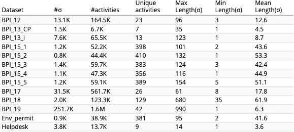

# Truncated Trace Classifier
This repository contains the full benchmark implementations, the parameters, the event logs, and the results of the paper "Truncated Trace Classifier" currently under review. 

There are three mains. 
1. [benchmark.py](benchmark.py): comparing various TTC implementations on 13 event logs
2. [processQuality/main.py](processQuality/main.py): discovering process models from event logs that are truncated at various level and comparing the results with a TTC and without a TTC. To assess this, we generated synthetic process models 
3. [nextEvent/main.py](nextEvent/main.py): Showing that the accuracy of predicting the next event can be improved when a TTC. In this code, we don't generate the TTC, but we simply load the ones that were made in the benchmark. Therefore, you first need to run the benchmark and change the path of the report.

## Datasets
The 13 datasets were originally downloaded from 
[https://data.4tu.nl/repository/collection:event_logs_real](https://data.4tu.nl/repository/collection:event_logs_real). The main characteristcs of the data are visible below.

In addition to the untouched version of the datasets, we also ran experiments where we manually truncate 10% and 20% of the traces, respectively. Please refer to the paper for more detailed explanation. The script [nextEvent/generate_ds_with_noise.py] was used to cut the datasets. The ground truth (the traces that were cut) is available in the folder [datasets/gt_noise](datasets/gt_noise)

